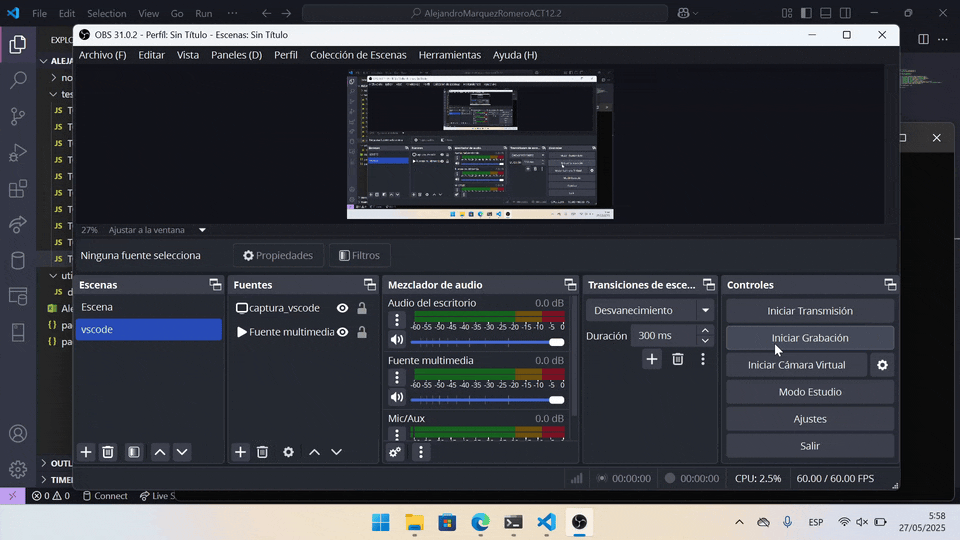
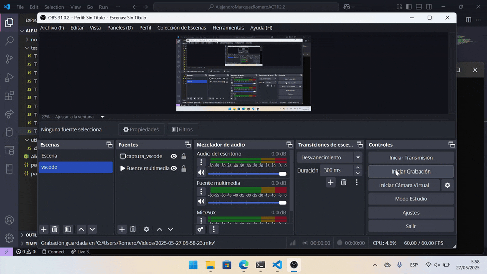
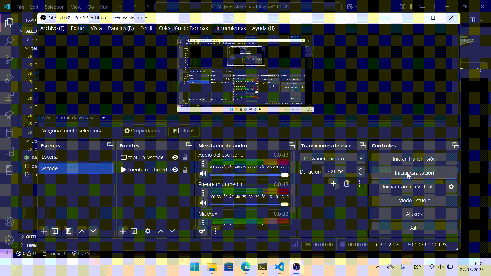
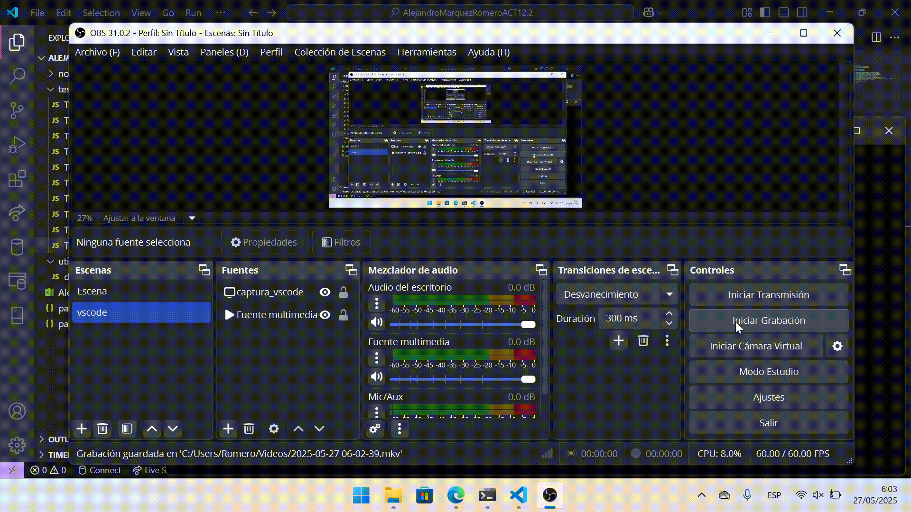

# Alejandro Márquez Romero - Diseño y Automatización - OrangeHRM Open Source

Este proyecto forma parte de la tarea **ACT12.2** de la asignatura ED. Su objetivo es automatizar diez casos de prueba funcionales para el sistema OrangeHRM Open Source utilizando **Node.js**, **Selenium WebDriver**, y **ChromeDriver**.

---

## 🧩 Índice
1. [Diseño de pruebas de bajo nivel](#1-diseño-de-pruebas-de-bajo-nivel)
2. [Stack tecnológico utilizado](#2-stack-tecnológico-utilizado)
3. [Estructura del proyecto](#3-estructura-del-proyecto)
4. [Instalación del entorno](#4-instalación-del-entorno)
5. [Ejecución de los tests](#5-ejecución-de-los-tests)
6. [GIFs de ejecución](#6-gifs-de-ejecución)

---

## 1. Diseño de pruebas de bajo nivel

Se ha elaborado una hoja de cálculo en base a la plantilla proporcionada, con los siguientes campos completados para los casos de prueba TC01 a TC10:

- `TestID`
- `TestName`
- `Precondition`
- `StepNumber`
- `StepAction`
- `StepCondition`
- `StepData`

La hoja de cálculo está en este mismo directorio que este archivo README.md .

---

## 2. Stack tecnológico utilizado

- **Node.js** (Entorno de ejecución)
- **Selenium WebDriver para JS** (Automatización de navegador)
- **ChromeDriver** (Control de navegador Google Chrome)
- **JavaScript** (Lenguaje de scripting)

---

## 3. Estructura del proyecto

La rama del repositorio es 'ACT12.2' .

```
AlejandroMarquezRomeroACT12.2/
│   ├── node_modules/             # tiene muchas carpetas y un archivo llamado '.package-lock.json'
│   ├── tests/                    # Carpeta con scripts de pruebas
│   │   ├── TC01_login.js
│   │   ├── TC02_adminJob.js
│   │   ├── TC03_adminNationalities.js
│   │   ├── TC04_adminGeneralInfo.js
│   │   ├── TC05_addEmployee.js
│   │   ├── TC06_pimReports.js
│   │   ├── TC07_searchEmployee.js
│   │   ├── TC08_employeeEntitlements.js
│   │   ├── TC09_leaveReports.js
│   │   └── TC10_assignLeave.js
│   ├── utils/
│   │   └── driver.js             # Configuración reutilizable de Selenium
│   ├── package-lock.json
│   ├── package.json              # Dependencias del proyecto
│   └── README.md                 # Documentación de la tarea
```

---

## 4. Instalación del entorno

### 1. Instalar dependencias globales

```bash
npm init -y
npm install selenium-webdriver chromedriver
```

> Nota: Asegúrate de tener Google Chrome y Node.js instalados en tu sistema.

### 2. Crear archivos y carpetas

```bash
mkdir tests
mkdir utils
echo "// configuración del driver" > utils/driver.js
echo "// script de prueba" > tests/TC01_login.js
```

El archivo `utils/driver.js` tiene este contenido:

```js
const { Builder } = require('selenium-webdriver');

async function getDriver() {
  return await new Builder().forBrowser('chrome').build();
}

module.exports = getDriver;
```

---

## 5. Ejecución de los tests

Cada script se puede ejecutar individualmente desde la terminal estando dentro de la carpeta 'tests' que está dentro de la carpeta principal 'AlejandroMarquezRomeroACT12.2' y ejecutando 'node' + el nombre del archivo. Ejemplo para ejecutar la prueba de test TC01:

```bash
node TC01.js
```

---

## 6. GIFs de ejecución

Aquí se incluyen los GIFs que muestran la ejecución automática de cada test funcionando correctamente:











---
